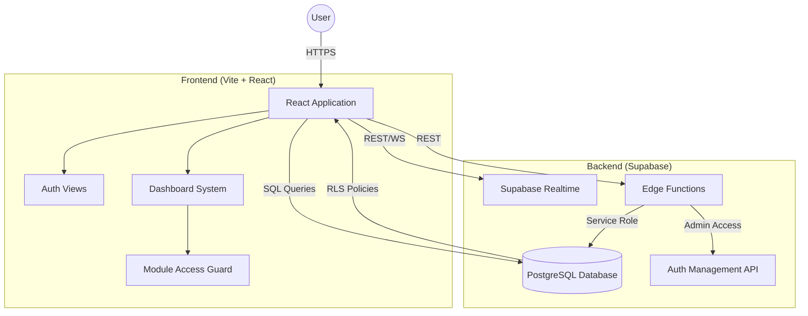

# Architecture & Tech Stack

This document outlines the high-level architecture and the technical ecosystem of the Planivo Role Manager.

## Technical Stack

The project leverages a modern, highly scalable stack focused on rapid development and real-time capabilities.

- **Frontend Framework**: [Vite](https://vitejs.dev/) + [React](https://reactjs.org/)
- **Programming Language**: [TypeScript](https://www.typescriptlang.org/)
- **Backend as a Service**: [Supabase](https://supabase.com/)
    - **Database**: PostgreSQL with Row Level Security (RLS)
    - **Authentication**: Supabase Auth
    - **Edge Functions**: Deno-based serverless functions for secure administrative tasks (e.g., user creation).
    - **Real-time**: Postgres Change Data Capture for Messaging.
- **Styling**: [Tailwind CSS](https://tailwindcss.com/)
- **UI Components**: [shadcn/ui](https://ui.shadcn.com/) based on Radix UI.
- **State Management & Data Fetching**: [TanStack Query (React Query)](https://tanstack.com/query/latest)

## High-Level System Design

The application follows a standard Client-Server architecture where Supabase acts as the centralized backend.

## Key Architectural Principles

### 1. Security-First (RLS)
Instead of building a traditional middle-tier API for every request, we leverage PostgreSQL **Row Level Security (RLS)**. This ensures that even if the client is compromised, they can only access data explicitly allowed by their role and scope.

### 2. Role-Based Access Control (RBAC)
We implement a multi-tiered role system (Super Admin -> General Admin -> Supervisor -> Head -> Staff). Access to UI modules is dynamically controlled via the `ModuleGuard` and `useUserRole` hooks.

### 3. Serverless Admin Logic
Tasks that require elevated privileges (like `service_role` to create auth users without registration flows) are handled via **Supabase Edge Functions**. This keeps the client-side code lean and secure.

### 4. Real-time Communication
The messaging system utilizes Supabase Realtime to broadcast new messages to participants instantly, bypassing traditional polling mechanisms.
