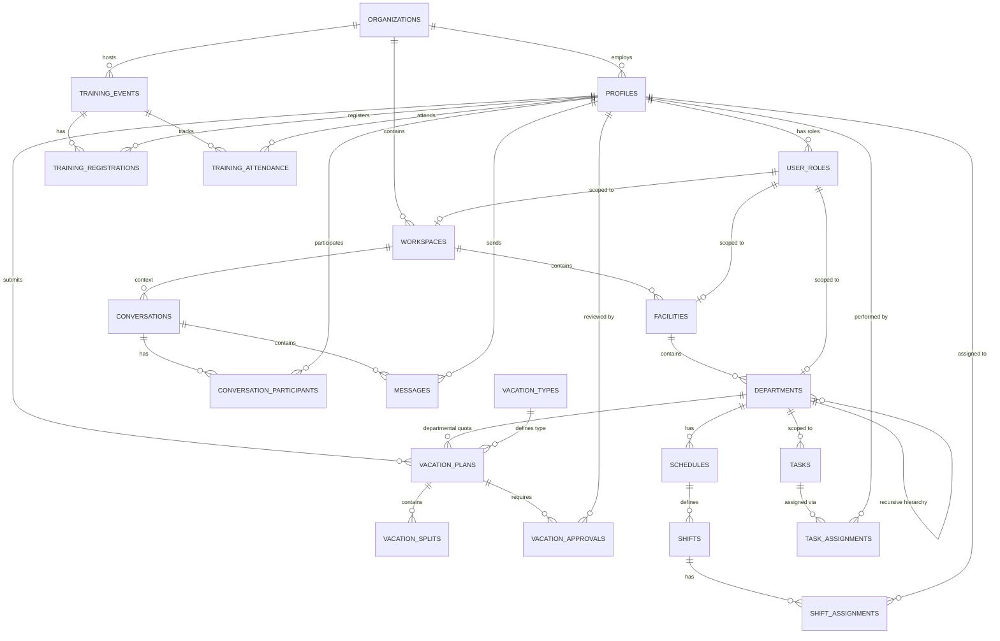
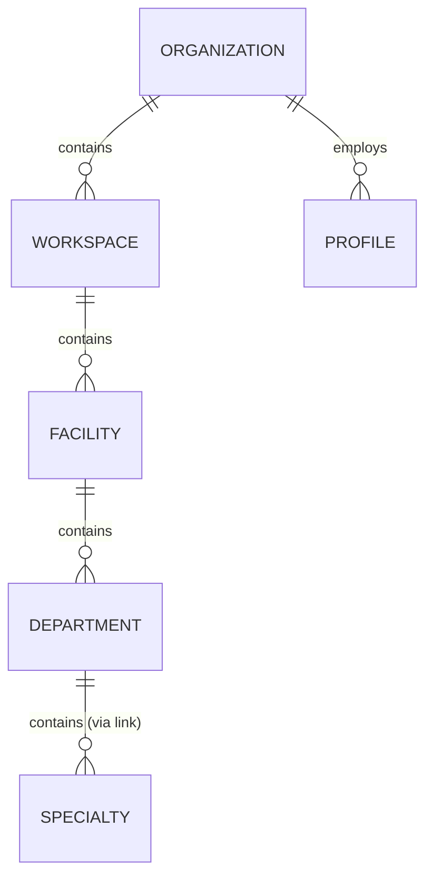

# Database Schema

This document provides a detailed overview of the PostgreSQL database schema used by Planivo Role Manager. All tables are located in the `public` schema and are protected by Row Level Security (RLS).

## Comprehensive Entity-Relationship Diagram (ERD)

The following diagram represents the core tables and their relationships across the entire application ecosystem.

## Core Entity Hierarchy

### Table: `organizations`
High-level tenant container.
- `id` (UUID, PK)
- `name` (Text)
- `owner_id` (UUID, FK -> profiles)
- `is_active` (Boolean)
- `max_workspaces`, `max_facilities`, `max_users` (Integer)

### Table: `workspaces`
Logical groupings within an organization (e.g., Regional Offices).
- `id` (UUID, PK)
- `organization_id` (UUID, FK)
- `name` (Text)
- `vacation_year_start_month` (Integer)

### Table: `facilities`
Physical locations within a workspace (e.g., Hospitals, Branch Offices).
- `id` (UUID, PK)
- `workspace_id` (UUID, FK)
- `name` (Text)

### Table: `departments`
Functional units within a facility or workspace templates.
- `id` (UUID, PK)
- `facility_id` (UUID, FK, Nullable for templates)
- `name` (Text)
- `category` (Text, used for themes like "Engineering")
- `is_template` (Boolean)

---

## User & Identity

### Table: `profiles`
Extended user data linked to Supabase Auth.
- `id` (UUID, PK, matches auth.users.id)
- `email` (Text, unique)
- `full_name` (Text)
- `is_active` (Boolean)
- `force_password_change` (Boolean)

### Table: `user_roles`
The core RBAC mapping. Links users to their scope of authority.
- `id` (UUID, PK)
- `user_id` (UUID, FK -> profiles)
- `role` (app_role enum)
- `workspace_id`, `facility_id`, `department_id` (UUID, FKs)
- `custom_role_id` (UUID, FK, optional)

---

## Messaging System

### Table: `conversations`
Container for messages between participants.
- `id` (UUID, PK)
- `is_group` (Boolean)
- `title` (Text, optional)

### Table: `messages`
The actual chat content.
- `id` (UUID, PK)
- `conversation_id` (UUID, FK)
- `sender_id` (UUID, FK -> profiles)
- `content` (Text)

---

## Vacation Planning

### Table: `vacation_plans`
Top-level vacation request.
- `id` (UUID, PK)
- `staff_id` (UUID, FK -> profiles)
- `status` (Text: pending, approved, rejected)
- `total_days` (Numeric)

### Table: `vacation_splits`
Individual date ranges within a single vacation plan.
- `id` (UUID, PK)
- `vacation_plan_id` (UUID, FK)
- `start_date`, `end_date` (Date)

---

## Security & Module Access

### Table: `module_definitions`
Master list of accessible app modules (e.g., "Messaging", "Users").

### Table: `role_module_access`
Default permissions assigned to static application roles.

### Table: `user_module_access`
Granular permission overrides for specific users.
